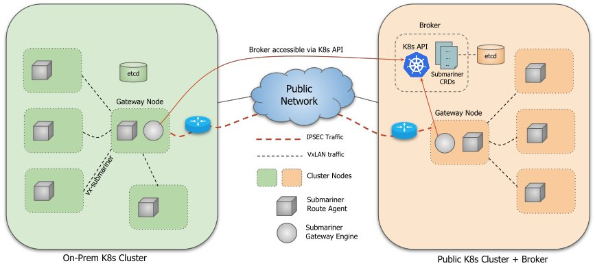

<!-- START doctoc generated TOC please keep comment here to allow auto update -->
<!-- DON'T EDIT THIS SECTION, INSTEAD RE-RUN doctoc TO UPDATE -->
**Table of Contents**  *generated with [DocToc](https://github.com/thlorenz/doctoc)*

- [Submariner](#submariner)
- [Architecture](#architecture)
  - [submariner](#submariner)
  - [submariner-route-agent](#submariner-route-agent)
  - [Network Path](#network-path)
- [Prerequisites](#prerequisites)
- [Installation](#installation)
  - [Installation using subctl](#installation-using-subctl)
    - [Download](#download)
    - [Broker](#broker)
    - [Engine and route agent](#engine-and-route-agent)
  - [Installation using operator](#installation-using-operator)
  - [Manual installation using helm charts](#manual-installation-using-helm-charts)
    - [Setup](#setup)
    - [Broker Installation/Setup](#broker-installationsetup)
    - [Submariner Installation/Setup](#submariner-installationsetup)
      - [Installation of Submariner in each cluster](#installation-of-submariner-in-each-cluster)
  - [Validate Submariner is Working](#validate-submariner-is-working)
- [Testing](#testing)
- [Known Issues/Notes](#known-issuesnotes)
    - [Openshift Notes](#openshift-notes)
- [Building](#building)
- [Contributing](#contributing)
- [TODO](#todo)

<!-- END doctoc generated TOC please keep comment here to allow auto update -->

# Submariner

[](https://github.com/submariner-io/submariner/actions?query=workflow%3A%22End+to+End+Tests%22+branch%3Amaster) [](https://github.com/submariner-io/submariner/actions?query=workflow%3Avalidation+branch%3Amaster) [](https://godoc.org/github.com/submariner-io/submariner) [](https://goreportcard.com/report/github.com/submariner-io/submariner)

Submariner is a tool built to connect overlay networks of different Kubernetes clusters. While most testing is performed against Kubernetes clusters that have enabled Flannel/Canal/Weavenet/OpenShiftSDN, Submariner should be compatible with any CNI-compatible cluster network provider, as it utilizes off-the-shelf components such as strongSwan/Charon to establish IPsec tunnels between each Kubernetes cluster.

Note that Submariner is in the **pre-alpha** stage, and should not be used for production purposes. While we welcome usage/experimentation with it, it is quite possible that you could run into severe bugs with it, and as such this is why it has this labeled status.

# Architecture

The basic architecture diagram for Submariner is as follows:



Submariner consists of a few components that work and operate off of Kubernetes Custom Resource Definitions (CRDs). The Submariner CRDs are `clusters.submariner.io` and `endpoints.submariner.io`. 

The two primary Submariner components within connected clusters are:

- submariner-gateway (DaemonSet)
- submariner-route-agent (DaemonSet)

The `submariner-gateway` pods are run on the gateway-labeled nodes and perform a leader election between them to elect an active IPsec endpoint. The `submariner-route-agent` component runs on every node and is aware of the current active gateway. When running on the active gateway node, the `submariner-route-agent` creates a VxLAN VTEP interface to which the `submariner-route-agent` instances running on the other worker nodes connect by establishing a VXLAN tunnel with the VTEP of the active gateway node. The `submariner-route-agent` also configures routes and programs the necessary iptable rules to enable full connectivity to the remote clusters. The MTU of Submariner VxLAN tunnel is configured based on the MTU of the default interface on the host minus VxLAN overhead.

Upon startup, the `submariner-gateway` pod that is elected leader will perform a reconciliation process that ensures it is the sole endpoint for this cluster. This is part of the reason why it is important to have unique cluster IDs between clusters, as two clusters with the same ID will reconcile each other out of existence.

Upon failure, another `submariner-gateway` pod (on one of the other gateway nodes) will gain leadership and perform reconciliation to ensure it is the active leader. When done, the remote clusters will reconcile the IPsec endpoint to the new endpoint, and connection will be re-established. In addition, the `submariner-route-agent` pods will update the route tables on each node to point to the new active gateway node.

Submariner uses a central broker to facilitate the exchange of information and sync CRD's between clusters. The `datastoresyncer` runs as a controller within the leader-elected `submariner` pod, and is responsible for performing a two-way synchronization between the datastore and local cluster of Submariner CRDs. The `datastoresyncer` will only push CRD data to the central broker for the local cluster (based on cluster ID), and will sync all data from the broker the local cluster when the data does not match the local cluster (to prevent circular loops)

## submariner-gateway

submariner-gateway (compiled as the binary `submariner-engine`) has a few controllers built into it that establish state. It is responsible for running/interfacing with Charon to establish IPsec tunnels, as well as updating local cluster information into the central broker to share information between clusters.

submariner-gateway runs as a DaemonSet on the gateway-labelled nodes and utilizes leader election to establish an active gateway node, which is used to facilitate IPsec tunnel connections to remote clusters.

## submariner-route-agent

The submariner-route-agent runs as a DaemonSet on all Kubernetes worker nodes, and ensures route rules to allow all pods/nodes to communicate through the elected gateway node for remote cluster networks. It will ensure state and react on CRD changes, which means that it is able to remove/add routes as leader election occurs.

## Network Path

The network path of Submariner varies depending on the origin/destination of the IP traffic. In all cases, traffic between two clusters will transit between the leader elected (in each cluster) gateway nodes, through `ip xfrm` rules. Each gateway node has a running Charon daemon which will perform IPsec keying and policy management. 

When the source pod is on a worker node that is not the elected gateway node, the traffic destined for the remote cluster will transit through the submariner VxLAN tunnel (`vx-submariner`) to the local cluster gateway node. On the gateway node, traffic is encapsulated in an IPSEC tunnel and forwarded to the remote cluster. Once the traffic reaches the destination gateway node, it is routed in one of two ways, depending on the destination CIDR. If the destination CIDR is a pod network, the traffic is routed via CNI-programmed network. If the destination CIDR is a service network, then traffic is routed through the facility configured via kube-proxy on the destination gateway node.

# Prerequisites

Submariner has a few requirements in order to get started:

- At least 2 Kubernetes clusters, one of which is designated to serve as the central broker that is accessible by all of your connected clusters; this can be one of your connected clusters, but comes with the limitation that the cluster is required to be up in order to facilitate interconnectivity/negotiation
- Different cluster/service CIDR's (as well as different kubernetes DNS suffixes) between clusters. This is to prevent traffic selector/policy/routing conflicts. Note: Submariner also supports clusters with Overlapping CIDRs via [Globalnet Controller](https://submariner-io.github.io/architecture/globalnet/).
- Direct IP connectivity between instances through the internet (or on the same network if not running Submariner over the internet). Submariner supports 1:1 NAT setups, but has a few caveats/provider specific configuration instructions in this configuration.
- Knowledge of each cluster's network configuration
- Helm version that supports crd-install hook (v2.12.1+)
- Worker node IPs on all the clusters must be outside of the cluster/service CIDR ranges.

An example of three clusters configured to use with Submariner would look like the following:

| Cluster Name | Provider | Cluster CIDR | Service CIDR | DNS Suffix |
|:-------------|:---------|:-------------|:-------------|:-----------|
| broker       | AWS      | 10.42.0.0/16 | 10.43.0.0/16 | cluster.local |
| west         | vSphere  | 10.0.0.0/16  | 10.1.0.0/16  | west.local |
| east         | AWS      | 10.98.0.0/16 | 10.99.0.0/16 | east.local |

# Installation

Submariner installation can be done manually using a dedicated tool, `subctl`, or Helm charts, or
by using its operator. All three methods are described here.

## Installation using subctl

`subctl` is a Submariner-specific tool developed to simplify Submariner installation. It drives
[the operator](#installation-using-operator). You can see it in action in
[this demo](https://youtu.be/cInmBXuZsU8).

### Download

`subctl` is maintained in the operator project and its binaries are available for download from
[the operator releases](https://github.com/submariner-io/submariner-operator/releases).
Download the latest binary for your operating system and architecture, then install it on your
path. The binary has no external dependencies so you won’t need anything else.

For example, to download v0.1.0 for Linux amd64 and install it in `~/.local/bin`:

    mkdir -p ~/.local/bin
    wget https://github.com/submariner-io/submariner-operator/releases/download/v0.1.0/subctl-v0.1.0-linux-amd64
    install subctl-v0.1.0-linux-amd64 ~/.local/bin/subctl
    rm subctl-v0.1.0-linux-amd64

If `~/.local/bin` is on your `PATH`, you will then be able to run `subctl`.

### Broker

To deploy only the broker in a cluster, run

    subctl deploy-broker --kubeconfig /path/to/your/config --no-dataplane

`/path/to/your/config` must correspond to the `kubeconfig` of the target cluster.

This command also saves a file, `broker-info.subm`, that will
be used to join other clusters to the broker.

### Engine and route agent

To install the engine and route agent, run

    subctl join --kubeconfig /path/to/your/config broker-info.subm

`/path/to/your/config` must correspond to the `kubeconfig` of the joining cluster.
`broker-info.subm` is the file obtained from the broker deployment and is used to join the cluster to that broker.

This command will ask for any missing information, in particular a unique identifier/name for
the cluster and the cluster node to use as a gateway.
It will then install [the Submariner operator](#installation-using-operator) and configure it to
deploy the Submariner components and join the cluster to the broker.

## Installation using operator

An operator is a tool to package, manage and deploy any Kubernetes application. A submariner operator will soon be available on [OperatorHub.io](https://operatorhub.io).

## TODO: Add instructions on how to install using operator

## Manual installation using helm charts

### Setup

Submariner utilizes the following tools for installation:

- `kubectl`
- `helm`
- `base64`
- `cat`
- `tr`
- `fold`
- `head`

These instructions assume you have a combined kube config file with at least three contexts that correspond to the respective clusters. Thus, you should be able to perform commands like

```
kubectl config use-context broker
kubectl config use-context west
kubectl config use-context east
```

Submariner utilizes Helm as a package management tool. 

Before you start, you should add the `submariner-latest` chart repository to deploy the Submariner helm charts.

```
helm repo add submariner-latest https://releases.rancher.com/submariner-charts/latest
```

### Broker Installation/Setup

The broker is the component that Submariner utilizes to exchange metadata information between clusters for connection information. This should only be installed once on your central broker cluster. Currently, the broker is implemented by utilizing the Kubernetes API, but is modular and will be enhanced in the future to bring support for other interfaces. The broker can be installed by using a helm chart.

First, you should switch into the context for the broker cluster
```
kubectl config use-context <BROKER_CONTEXT>
```

If you have not yet initialized Tiller on the cluster, you can do so with the following commands:

```
kubectl -n kube-system create serviceaccount tiller

kubectl create clusterrolebinding tiller \
  --clusterrole=cluster-admin \
  --serviceaccount=kube-system:tiller

helm init --service-account tiller
```

Wait for Tiller to initialize

```
kubectl -n kube-system  rollout status deploy/tiller-deploy
```

Once tiller is initialized, you can install the Submariner K8s Broker

```
helm repo update

SUBMARINER_BROKER_NS=submariner-k8s-broker

helm install submariner-latest/submariner-k8s-broker \
--name ${SUBMARINER_BROKER_NS} \
--namespace ${SUBMARINER_BROKER_NS}
```

Once you install the broker, you can retrieve the Kubernetes API server information (if not known) and service account token for the client by utilizing the following commands:

```
SUBMARINER_BROKER_URL=$(kubectl -n default get endpoints kubernetes -o jsonpath="{.subsets[0].addresses[0].ip}:{.subsets[0].ports[?(@.name=='https')].port}")

SUBMARINER_BROKER_CA=$(kubectl -n ${SUBMARINER_BROKER_NS} get secrets -o jsonpath="{.items[?(@.metadata.annotations['kubernetes\.io/service-account\.name']=='${SUBMARINER_BROKER_NS}-client')].data['ca\.crt']}")

SUBMARINER_BROKER_TOKEN=$(kubectl -n ${SUBMARINER_BROKER_NS} get secrets -o jsonpath="{.items[?(@.metadata.annotations['kubernetes\.io/service-account\.name']=='${SUBMARINER_BROKER_NS}-client')].data.token}"|base64 --decode)
```

These environment variables will be utilized in later steps, so keep the values in a safe place.

### Submariner Installation/Setup

Submariner is installed by using a helm chart. Once you populate the environment variables for the token and broker URL, you should be able to install Submariner into your clusters.

1. Generate a Pre-Shared Key for Submariner. This key will be used for all of your clusters, so keep it somewhere safe.

   ```
   SUBMARINER_PSK=$(cat /dev/urandom | LC_CTYPE=C tr -dc 'a-zA-Z0-9' | fold -w 64 | head -n 1)
   echo $SUBMARINER_PSK
   ```

1. Update the helm repository to pull the latest version of the Submariner charts

   ```
   helm repo update
   ```
   
#### Installation of Submariner in each cluster

Each cluster that will be connected must have Submariner installed within it. You must repeat these steps for each cluster that you add.
   
1. Set your kubeconfig context to your desired installation cluster

   ```
   kubectl config use-context <CLUSTER_CONTEXT>
   ```

1. Label your gateway nodes with the annotation `submariner.io/gateway=true`

   ```
   kubectl label node <DESIRED_NODE> "submariner.io/gateway=true"
   ```

1. Initialize Helm (if not yet done)

   ```
   kubectl -n kube-system create serviceaccount tiller

   kubectl create clusterrolebinding tiller \
     --clusterrole=cluster-admin \
     --serviceaccount=kube-system:tiller

   helm init --service-account tiller
   ```

1. Wait for Tiller to initialize

   ```
   kubectl -n kube-system  rollout status deploy/tiller-deploy
   ```
1. Install submariner into this cluster. The values within the following command correspond to the table below.

   ```
   helm install submariner-latest/submariner \
   --name submariner \
   --namespace submariner \
   --set ipsec.psk="${SUBMARINER_PSK}" \
   --set broker.server="${SUBMARINER_BROKER_URL}" \
   --set broker.token="${SUBMARINER_BROKER_TOKEN}" \
   --set broker.namespace="${SUBMARINER_BROKER_NS}" \
   --set broker.ca="${SUBMARINER_BROKER_CA}" \
   \
   --set submariner.clusterId="<CLUSTER_ID>" \
   --set submariner.clusterCidr="<CLUSTER_CIDR>" \
   --set submariner.serviceCidr="<SERVICE_CIDR>" \
   --set submariner.natEnabled="<NAT_ENABLED>"
   ```
   
   |Placeholder|Description|Default|Example|
   |:----------|:----------|:------|:------|
   |\<CLUSTER_ID>|Cluster ID (Must be RFC 1123 compliant)|""|west-cluster|
   |\<CLUSTER_CIDR>|Cluster CIDR for Cluster|""|`10.42.0.0/16`|
   |\<SERVICE_CIDR>|Service CIDR for Cluster|""|`10.43.0.0/16`|
   |\<NAT_ENABLED>|If in a cloud provider that uses 1:1 NAT between instances (for example, AWS VPC), you should set this to `true` so that Submariner is aware of the 1:1 NAT condition.|"false"|`false`|

## Validate Submariner is Working

Switch to the context of one of your clusters, i.e. `kubectl config use-context west`

Run an nginx container in this cluster, i.e. `kubectl run -n default nginx --image=nginx`

Retrieve the pod IP of the nginx container, looking under the "Pod IP" column for `kubectl get pod -n default`

Change contexts to your other workload cluster, i.e. `kubectl config use-context east`

Run a busybox pod and ping/curl the nginx pod:

```
kubectl run -i -t busybox --image=busybox --restart=Never
If you don't see a command prompt, try pressing enter.
/ # ping <NGINX_POD_IP>
/ # wget -O - <NGINX_POD_IP>
```

# Testing

Submariner functionality can be tested by running [E2E test suites](https://github.com/submariner-io/submariner/tree/master/test/e2e). 
Please refer [testing guide](https://github.com/submariner-io/submariner/tree/master/docs/testing.md) for more details.

# Known Issues/Notes

## Openshift Notes

When running in Openshift, we need to grant the appropriate security context for the service accounts
   
   ```
   oc adm policy add-scc-to-user privileged system:serviceaccount:submariner:submariner-routeagent
   oc adm policy add-scc-to-user privileged system:serviceaccount:submariner:submariner-engine 
   ```
   
# Building

To build `submariner-engine` and `submariner-route-agent` you can trigger `make`, which will perform a Dapperized build of the components.

Buidling submariner happens inside a docker based virtual environment (based in dapper).
You can jump into a virtual environment shell by typing:

   ```
   make shell
   ```

# Contributing

We welcome issues/PR's to Submariner, if you encounter issues that you'd like to fix while working on it or find new features that you'd like. Please refer [contributing guide](https://github.com/submariner-io/submariner/tree/master/docs/contributing.md) for more details.

# TODO

- Potentially spin out Charon into it's own pod to help decrease downtime
- Better clean up of IPtables rules when node loses leader election
- Central API server that is hosted by Rancher
