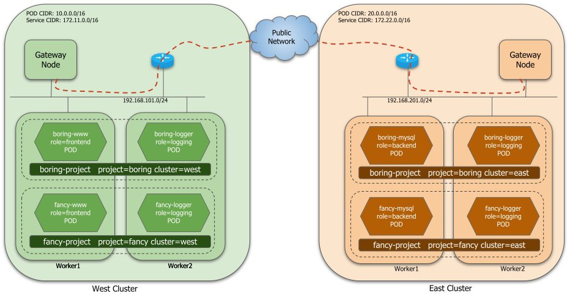
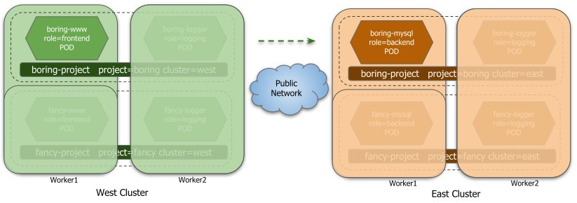
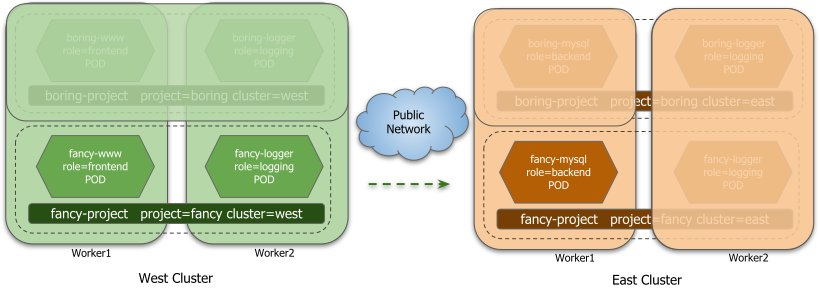
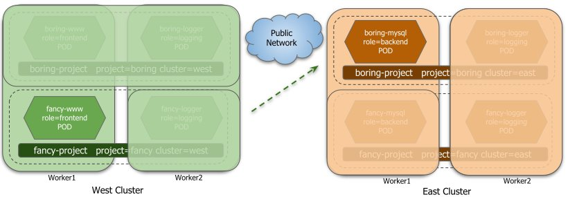
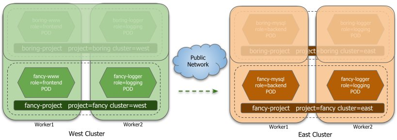

## Multicluster Network Policy support

This document describes the Network Policy use cases that we propose
supporting for a first iteration in Submariner. In this iteration, the
intention is to support the ingress side of existing k8s Network Policies
as is, while in the future we could explore with the kubernetes community
options to extend Network Policies for multi cluster scenarios.

> A Kubernetes network policy is a specification of how pods are allowed
> to communicate with each other and other network endpoints. 
> It is similar to Access Control Lists where one can specify the traffic
> that would be allowed/denied to the pods. Network Policies are additive,
> so having two Network Policies that select the same pods will result in
> allowing both defined policies.


> Network Policies are implemented by the underlying networking CNI plugin
> for the k8s cluster. Some CNIs don't implement Network Policies, this
> feature assumes that the CNI being used at least provides intra-cluster
> Network policy support.

## Diagram

The following diagram depicts two clusters and two namespaces. Those resources
will be referenced in the use cases.



The cluster labels for the namespaces are just illustrative examples of
label assignment. The admin could follow that pattern or a different
pattern. In future, we could integrate with federation
[ClusterID](https://docs.google.com/document/d/1F__vEKeI41P7PPUCMM9PVPYY34pyrvQI5rbTJVnS5c4/edit)
which is being discussed in the k8s multicluster-sig.

For the initial implementation (still under design) it is assumed that
pod/service CIDRs are non-overlapping, and that we preserve the
source IP address on the datapath. In parallel we are also considering
technical solutions to be able to support overlapping CIDRs in the future.

The examples shown below can be extrapolated to UDP/SCTP too.

We are only trying to tackle Ingress policies for a first iteration, same
design could apply to egress policy for later iterations.

## Use cases


| Use-case |       Description                                       |
| -------  | ------------------------------------------------------- |
|    1     | Connected Clusters without any Network Policy           |
|    2     | Allow frontend pods from a remote cluster in the same project to access the backend pods on the local cluster. |
|    3     | Allow all the pods from the same project in a remote cluster to access the backend pod on the local cluster. |
|    4     | Allow frontend pod from a different project in a remote cluster to access the backend pod on the local cluster. |
|    5     | Allow all the pods from the same project which are either in the local cluster or remote cluster to access the logging pod on the local cluster. |


### 1. Connected Clusters with No Network Policies
Normally in a single cluster when there are no network policies, which implies that
every pod can connect to other pods without any restriction. When two (or more)
clusters are connected via Submariner, we would preserve the same behavior across
the clusters (i.e., pods in one cluster can access pods in remote clusters) until
network policies are added by the administrator.


### 2.PodSelector based Network Policies for ingress between clusters

2.1 Allow frontend pods (boring-www) from boring-project in any cluster to
access the backend pods (boring-mysql) on boring-project at east cluster
over tcp/6379.



```yaml
apiVersion: networking.k8s.io/v1
kind: NetworkPolicy
metadata:
  name: all-boring-project-frontends-can-talk-to-backend
  namespace: boring-project
spec:
  podSelector:
    matchLabels: # or matchexpression
      role: backend
  policyTypes:
  - Ingress
  ingress:
  - from:
    - podSelector:
        matchLabels:
          role: frontend
    ports: # Multiple ports can be specified
    - protocol: TCP
      port: 6379
```


  > Notes:
  > * podSelector only works on the existing namespaces, if we want to
  >   select pods from other namespaces too (locally or on remote clusters,
  >   we need to combine with the NamespaceSelector -use case 4-)
  > * PodSelector based Network Policies for ingress between clusters

2.2 Allow boring-www from west cluster to be able to access the boring-mysql
pod on east cluster over tcp/6379. But if any frontend pod existed in
boring-project in east cluster, such pod wouldn’t be allowed by this
specific policy.

Admin creates a policy in East cluster, in the boring-project namespace:

```yaml
apiVersion: networking.k8s.io/v1
kind: NetworkPolicy
metadata:
  name: all-boring-frontends-from-west-can-talk-to-backend
  namespace: boring-project
spec:
  podSelector:
    matchLabels: # or matchexpression
      role: backend
  policyTypes:
  - Ingress
  ingress:
  - from:
     podSelector:
        matchLabels:
          role: frontend
          cluster: west
    ports: # Multiple ports can be specified
    - protocol: TCP
      port: 6379
```

> Note:
> For this kind of matching, we would need the admin to configure the pods
> with such label, or something that automatically annotates pods with the
> cluster identification as a label.


### 3.NamespaceSelector based Network Policies for ingress between clusters

Allow any pod in the fancy project namespace (fancy-www and fancy-logger)
from west cluster (and only the west cluster) to be able to access the
fancy-mysql pod at east cluster over port tcp/6379.



Admin creates a Policy in East cluster, in the fancy-project namespace

```yaml
apiVersion: networking.k8s.io/v1
kind: NetworkPolicy
metadata:
  name: all-pods-in-fancy-ns-from-west-can-talk-to-backend-pods
  namespace: fancy-project
spec:
  podSelector:
    matchLabels:
      role: backend
  policyTypes:
  - Ingress
  ingress:
  - from:
    - namespaceSelector:
        matchLabels: # this could be {} to select all
          project: fancy
          cluster: west
    ports:
    - protocol: TCP
      port: 6379
```

> Note:
> In this case the cluster: west label match will prevent east cluster
> pods in the fancy namespace from being allowed.

### 4.PodSelector + NamespaceSelector based Network Policies for ingress between clusters

Allow frontend pods on the fancy project on the west cluster to access
the backend pods on the boring project on east cluster.



Admin creates policy in East cluster, in boring-project namespace


```yaml
apiVersion: networking.k8s.io/v1
kind: NetworkPolicy
metadata:
  name: west-frontend-fancy-can-talk-to-east-backend-boring
  namespace: boring-project
spec:
  podSelector:
    matchLabels:
      role: backend
  policyTypes:
  - Ingress
  ingress:
  - from:
    - namespaceSelector:
        matchLabels:
          project: fancy
          cluster: west
      podSelector:
        matchLabels:
          role: frontend
    ports:
    - protocol: TCP
      port: 6379
```

### 5. NamespaceSelector based Network Policies for ingress between clusters, selecting multiple remote clusters

Allow any pod in the fancy project namespace from clusters east, west,
or "north" (fancy-www, fancy-logger, fancy-mysql) to access logging pods
in the east cluster fancy project over tcp/1234.



Policy created in East cluster, in fancy-project namespace

```yaml
apiVersion: networking.k8s.io/v1
kind: NetworkPolicy
metadata:
  name: pods-in-fancy-ns-from-e-w-n-can-talk-to-logging
  namespace: fancy-project
spec:
  podSelector:
    matchLabels:
      role: logging
  policyTypes:
  - Ingress
  ingress:
  - from:
    - namespaceSelector:
        matchExpressions:
          - {key: cluster, operator: In, values: [east, west, north]}
        matchLabels:
          project: fancy
    ports:
    - protocol: TCP
      port: 1234

```
