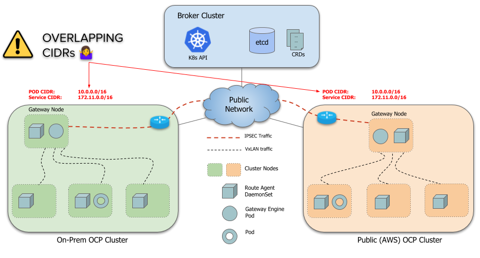
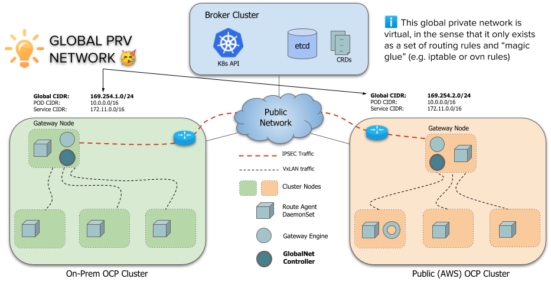

# Introduction

Submariner is a tool built to connect overlay networks of different Kubernetes clusters. These clusters can be on different public clouds or on-premise. An important use case for Submariner is to connect disparate independent clusters into a single cohesive multi-cluster.
 However, one key limitation of submariner's current design is that it doesn't support overlapping CIDRs (ServiceCIDR and ClusterCIDR) across these clusters. Each cluster must use distinct CIDRs that don't conflict or overlap with any other cluster that is going to be part of cluster fleet.

This is largely problematic because most actual deployments use the default CIDRs for a cluster so every cluster ends up using the same CIDRs. Changing CIDRs on existing clusters is a very disruptive process and requires a cluster restart. So submariner needs a way to allow clusters with overlapping CIDRs to connect together.

# Architecture

To support overlapping CIDRs in clusters connected through submariner, we're introducing a new component called Global Private Network, GlobalNet (`globalnet`). This GlobalNet is a virtual network specifically to support submariner's multi-cluster solution with a Global CIDR. Each cluster is given a subnet from this Global Private Network, configured as new cluster parameter `GlobalCIDR` (e.g. 169.254.0.0/16) which is configurable at time of deployment

Once configured, each service and pod that requires cross-cluster access is allocated an IP, `GlobalIp` from this `GlobalCIDR` and it is annotated on the Pod/Service object. This `GlobalIp` is used for all cross-cluster communication to and from to this Pod/Service. Routing and IPTable/OVS/OVN rules are configured to use this IP for ingress and egress. All address translations occur on the Gateway node.

## submariner-globalnet

Submariner GlobalNet is a coponent that provides cross-cluster connectivity between pods and services using their GlobalIps. Compiled as binary `submariner-globalnet`, it is the controller that is responsible for maintaining a pool of global IPs, allocating IPs from the globalIp pool to pods and services, annotating services and pods with their global Ip, and configuring the required rules on gateway node to provide cross-cluster connectivity using GlobalIps. It mainly consists of two key components: the IP Address Manager and Globalnet.

### IP Address Manager (IPAM)

The IP Address Manager (IPAM) component does the following:

* Creates a pool of IP addresses based on `GlobalCIDR` configured on cluster.
* On creation of a Pod/Service, allocates a GlobalIp from the GlobalIp pool.
* Annotates the Pod/Service with `submariner.io/GlobalIp=<global-ip>`.
* On deletion of a Pod/Service, releases its GlobalIp back to the pool.

### Globalnet

This component is responsible for programming the routing entries and IPTable rules and does the following:

* Creates initial IPTables chains for Globalnet rules.
* Whenever a pod is annotated with Global IP, creates an egress SNAT rule to convert source ip from PodIp to pod's GlobalIp on the Gateway Node.
* Whenever a service is annotated with Global IP, creates an ingress rule to direct all traffic destined to service's GlobalIp to the service's `kube-proxy` IPTables chain which in turn directs traffic to service's backend pods.
* On deletion of pod/service, clean up the rules from the gateway node.

Globalnet currently relies on `kube-proxy` and thus will only work with deployments that use `kube-proxy`.

## Service Discovery - Lighthouse

Connectivity is only part of the solution as pods still need to know the IPs of services on remote clusters.

This is achieved by enhancing [lighthouse](https://github.com/submariner-io/lighthouse) with support for GlobalNet. The Lighthouse controller adds the service's GlobalIp to the `MultiClusterService` object that is distributed to all clusters. The [lighthouse plugin](https://github.com/submariner-io/lighthouse/tree/master/plugin/lighthouse) then uses the service's GlobalIp when replying to DNS queries for the service.

# Installation

TBD.

# Testing

Refer [Testing guide](testing.md) for instructions on how to test, same steps apply.

# Known Issues

# Building

Nothing extra needs to be done to build `submariner-globalnet` as it is built with the standard submariner build.

# TODO

Not everything mentioned in the architecture is currently implemented. This section lists work items that are pending.

* Operator support for globalnet installation
* Helm support for globalnet installation
* `subctl` support for globalnet
* Lighthouse changes for globalnet
* User guide
